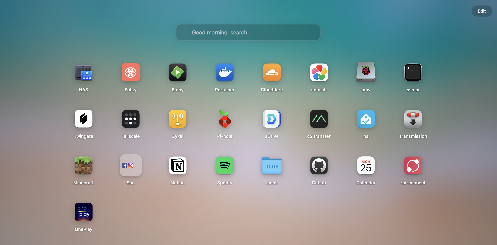

# iDash 

A minimalist, highly responsive startpage/dashboard for your homelab and daily web navigation. Inspired by macOS and iOS design principles, featuring glassmorphism, smooth animations, and a pure zero-database setup.

 

##  Features
* **Zero Database:** Everything is saved locally in a single `data.json` file.
* **macOS Liquid UI:** Native-feeling blur effects, translucent context menus, and perfectly balanced squircle icons.
* **Live Calendar Icon:** A dynamically generated Apple-like calendar icon showing the current date.
* **Drag & Drop:** Easily reorder your apps and folders with a smooth spring animation.
* **Folders Support:** Group your apps into iOS-style folders for ultimate organization.
* **Spotlight Search:** Type to instantly filter your apps, or hit Enter to search the web. **Pro tip: Press <kbd>/</kbd> from anywhere to instantly focus the search bar!**
* **Custom Backgrounds:** Change your wallpaper on the fly via URL.

## Quick Start (Docker)
The easiest and recommended way to get iDash running is via Docker. You don't even need to clone the repository!

Simply paste this entire block into your terminal. It will automatically create a folder, generate the necessary configuration, set up your data file, and start the dashboard:

```bash
mkdir -p idash && cd idash

cat << 'EOF' > docker-compose.yml
services:
  idash:
    image: ghcr.io/pastyriktadeas/idash:latest
    container_name: idash
    ports:
      - "8000:80"
    volumes:
      - ./data.json:/var/www/html/src/data.json
    restart: unless-stopped
EOF

echo "{}" > data.json
chmod 777 data.json

docker-compose up -d
```

Your dashboard is now beautifully shining at `http://localhost:8000` 

##  Usage & Customization
* **Edit Mode:** Click the `Edit` button in the top right corner to enter jiggle mode. 
* **Add Apps:** Click the translucent `+ Add` button. You can add regular links or create folders.
* **Context Menu:** Right-click any icon on the dashboard to open the custom macOS-style context menu for quick editing or deletion.
* **Special Icons:** When adding a new app, type `live-calendar` in the Icon URL field to get the dynamic daily calendar icon.

##  License
This project is licensed under the [MIT License](LICENSE).
